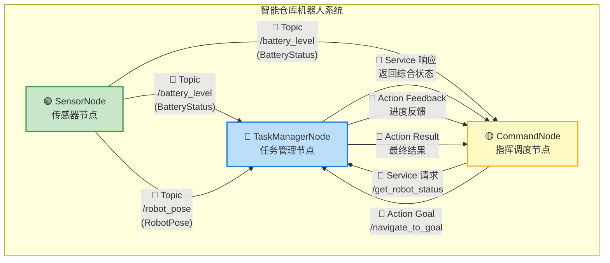

# 迷你项目uml类图

```mermaid
graph TB
    subgraph 智能仓库机器人系统
        SN["🟢 SensorNode<br/>传感器节点"]
        TM["🔵 TaskManagerNode<br/>任务管理节点"]
        CMD["🟡 CommandNode<br/>指挥调度节点"]
    end

    SN -->|"📡 Topic<br/>/battery_level<br/>(BatteryStatus)"| TM
    SN -->|"📡 Topic<br/>/robot_pose<br/>(RobotPose)"| TM
    SN -->|"📡 Topic<br/>/battery_level<br/>(BatteryStatus)"| CMD

    CMD -->|"🔧 Service 请求<br/>/get_robot_status"| TM
    TM -->|"🔧 Service 响应<br/>返回综合状态"| CMD

    CMD -->|"🎯 Action Goal<br/>/navigate_to_goal"| TM
    TM -->|"🎯 Action Feedback<br/>进度反馈"| CMD
    TM -->|"🎯 Action Result<br/>最终结果"| CMD

    style SN fill:#c8e6c9,stroke:#388e3c,stroke-width:2px
    style TM fill:#bbdefb,stroke:#1976d2,stroke-width:2px
    style CMD fill:#fff9c4,stroke:#f9a825,stroke-width:2px
```